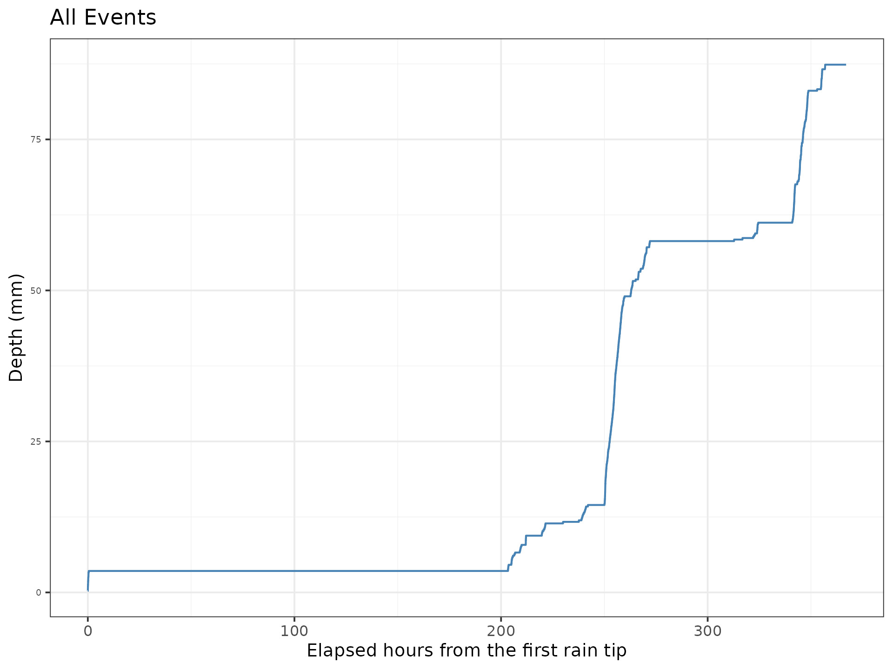
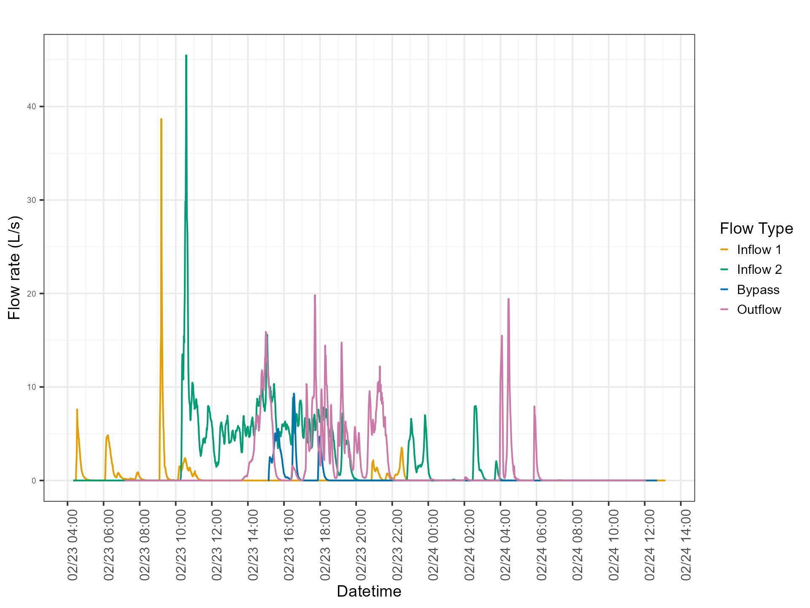

## Summary

Field-based performance studies of stormwater best managment practices (BMPs) generate large volumes of time series data from rain gauges, flow meters, and water level sensors [@davis_green_2022]. Practitioners often rely on ad hoc spreadsheets or inconsistent workflows for data reduction [@erickson_optimizing_2013]. This results in methodological variation across studies and limits reproducibility. 

## Statement of Need
The BMP Hydrology Calculator fills this gap by providing a centralized, open-source platform for applying standard hydrologic post-processing techniques in a consistent and automated manner. This web application has been developed to enable consistent, transparent, and easily applied calculations of rainfall, flow, and infiltration for stormwater BMP monitoring studies.

The BMP Hydrology Calculator provides three types of analyses:

1.	**Rainfall Analysis** - Generates the cumulative rainfall duration, rainfall depth, average rainfall intensity, and the maximum rainfall intensity over the entire storm and specified durations (e.g., 5, 10 or 60 minutes) for multiple storm events, and antecedent dry period based on a user-uploaded rainfall data (a.k.a. hyetograph).

2.	**Flow Analysis** - Calculates statistics from user-uploaded flowrate data (a.k.a. hydrographs) including total runoff volume, runoff duration, and the peak (maximum) flow rate. Multiple BMP configurations are supported, including when the BMP has monitored flow data from multiple inflows and/or bypass (a.k.a. "overflow"). 

3.	**Infiltration Analysis** - Calculates the infiltration rate of ponded water through a BMP based on water level depth measured over time. The calculation applies to water that moves across a soil-water interface, for example ponded runoff moving from the surface into a filtration media, or runoff stored in a subsurface BMP exfiltrating into the surrounding soil (e.g. the vadose zone). 

Each method applies a consistent set of calculations designed to mirror typical field monitoring workflows [@cook_npdess_1992; @geosyntec_urban_2009]. This approach ensures that essential stormwater BMP metrics (e.g., rainfall intensity, runoff volume, infiltration rates) are derived using transparent and reproducible methods, all within a unified web-based environment. The underlying equations and methodological assumptions used in each analysis are documented in detail in the project's [README](https://github.com/SCCWRP/rainfall_flow_calculator_shiny) on GitHub. 

This web application is intended for technical users. The calculators process data obtained from sensors to generate summary statistics commonly used to provide context for and/or interpret stormwater BMP performance; this web application itself does not provide any interpretation. While the motivation for creating the calculator was intended to support field monitoring of stormwater BMPs, it may be applied for other hydrologic monitoring applications where rainfall (hyetograph), flow (hydrograph), or infiltration analysis may be of interest. The user is responsible for raw data quality assurance. There are no checks of data quality built into the calculators, other than for missing data and formatting; **however, the infiltration calculator warns users if results are well outside expected values.** The documentation does not provide guidance on how to install sensors or collect field data. Users interested to learn more about stormwater BMP field monitoring are encouraged to review guidance from the International Stormwater BMP Database at https://bmpdatabase.org/monitoring [@geosyntec_urban_2009].

## Functionality

The BMP Hydrology Calculator is built as an RShiny (version 1.10.0 [@chang2024shiny]) web application that includes three analysis tools: Rainfall Analysis, Flow Analysis, and Infiltration Analysis. The frontend of the application, which handles tasks such as data upload, validation, processing, and result download, is programmed in R (version 4.4.1 [@r_core_2024]). The backend, which contains the code algorithms for computing the statistical outputs of the Rainfall, Flow, and Infiltration Analysis modules, is programmed in Python (version 3.10.11 [@python_software_foundation_2023]) and accessed via an API hosted on a remote server. The API server, available at https://nexus.sccwrp.org/bmp_hydrology, is released under the MIT license and can be deployed locally. The source code for the API is publically available at https://github.com/SCCWRP/bmp-hydrology-api.

On the RShiny web application, each calculator tab contains an *"Instruction"* page with guidance on how to format user data into the bespoke, downloadable data templates, as well as a *"Method"* page detailing the underlying equations and methodological assumptions. Step-by-step instructions for uploading, labeling, identifying units, and filtering the user data are included on the left-hand side of each calculator tab. 

The BMP Hydrology Calculator outputs include downloadable tables and figures. Herein, example calculator outputs are generated using the downloadable "demo data"; each calculator has its own demo dataset and timeseries template. 

**Rainfall Analysis**: User-uploaded rainfall data are visualized and analyzed. Output statistics include the number of unique events in the hyetograph record, rainfall duration and depth, average and peak rainfall intensity statistics, as well as the antecedent dry periods. 

*Table 1: Example rainfall analysis results showing unique rainfall events with intensity and dry period statistics.*

| Event ID | Storm Date Time  | Duration (hr)  | Total Rainfall (mm) | Avgerage Rainfall Intensity (mm/hr) | Peak 5-min Rainfall Intensity (mm/hr) | Peak 10-min Rainfall Intensity (mm/hr) | Peak 60-min Rainfall Intensity (mm/hr) | Antecedent Dry Period (days) |
|:--------:|:------------:|:------------:|:------------:|:------------:|:------------:|:------------:|:------------:|:------------:|
| 1        | 2/14/1950 16:59 | 0.45 | 3.56 | 7.9 | 12.19 |10.67| 3.56 | NA |
| 2        | 2/23/1950 4:22  | 68.65 | 54.61 | 0.8 | 15.24 |12.19 | 6.6 | 8.46 |
| 3        | 2/27/1950 17:47 | 11.65 | 3.05 | 0.26  | 6.1  |6.1 | 1.78  | 1.7  |
| 4        | 2/28/1950 21:57 | 15.9 | 26.16 | 1.65    | 12.19     | 9.14    |5.33    | 0.69   |

**Flow Analysis**: User-uploaded hydrograph data are visualized and analyzed. Output statistics include the peak flowrate, the runoff duration, and the total runoff volume. The output enables the user to compare inflow and outflow statistics for BMP performance assessment. Users are able to modify the period of data analysis on-screen, without changing the uploaded data file. Multiple BMP configurations are digestable by the Flow Analysis calculator; the example highlighted in Figure 3 is a BMP that has two inputs, outflow, and bypass all measured.

*Table 2: Example flow analysis results showing unique storm events with flow statistics.*

| Type of flow | Duration of Runoff (hr) | Runoff Volume (L) | Peak Flow Rate (L/s) | 
|:--------:|:------------:|:------------:|:------------:|
| inflow1        | 32.83                 | 34430.22        | 22.73                  | 
| inflow2        | 24.28                 |239978.76        | 36.12                  | 
| bypass        | 21.57                 | 19133.28        | 8.58                  | 
| outflow        | 28.9                 | 150722.46        | 17.05                  | 

**Infiltration Analysis**: User-uploaded depth data are visualized and analyzed to determine a characteristic infiltration rate on the regression limb (i.e., when the BMP is draining after a storm). An exponential decay model, expressed as $y(t) = y_0 e^{-k t}$, where $y_0$ is the initial depth, $k$ is the decay constant, and $t$ is time, is fit to the depth data using the SciPy `curve_fit` library [@scipy_curve_fit]. The calculator identifies the best-fit window (i.e., the duration of the regression limb) and reports the infiltration rate (length/time) for the draw-down event. Data from multiple sensors sharing the same timestamps can be analyzed concurrently. Data from multiple draw-down events (i.e., multiple storms) can also be submitted concurrently.

 

*Table 3: Example infiltration analysis results showing a unique storm event with its corresponding infiltration rate.*

| Piezometer | Infiltration Rate (mm/hr) | 
|:--------:|:------------:|
| Piezometer A | 1421.94 | 

## Acknowledgements

This tool was developed by the Southern California Coastal Water Research Project (SCCWRP) with support from the Southern California Stormwater Monitoring Coalition (SMC). We additionally thank Matt McGauley from Villanova University for providing foundational infiltration calculator logic, and Adrian Montoya from Riverside County Flood Control District for sharing piezometer data. 

## References

<!-- References will be automatically generated from bmphydrologycalculator.bib based on citations used in the text -->
